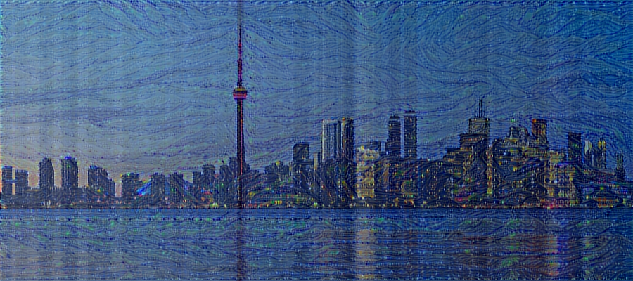

# Toronto Cityscape with Van Gogh's Starry Night - Neural Style Transfer



## Overview

This project combines the iconic cityscape of Toronto with the timeless beauty of Vincent van Gogh's Starry Night painting using neural style transfer techniques. By fine-tuning the VGG-19 neural network architecture, we were able to apply the artistic style of Starry Night to the Toronto cityscape image, creating a unique and visually captivating result.

## Prerequisites

Before running this project, ensure you have the following dependencies installed:

- Python 3.x
- TensorFlow
- Keras
- NumPy
- OpenCV
- (Any other specific libraries you used)

## Usage

1. **Clone the Repository:**

    ```bash
    git clone https://github.com/your_username/your_project.git](https://github.com/mehassanhmood/Neural-Style-Transfer.git
    ```

2. **Navigate to the Project Directory:**

    ```bash
    cd your_project
    ```

3. **Pass the image paths to the Neural Style Transfer Notebook:**


    Replace `toronto_cityscape.jpg` with your Toronto cityscape image and `starry_night.jpg` with your Van Gogh's Starry Night image. Adjust the output code block to specify the name of the styled output images.

4. **View the Result:**

    Once the script finishes execution, you can find the styled output image in the project directory.


## Credits

- Vincent van Gogh for his masterpiece, Starry Night.
- [University of Oxford's Visual Geometry Group (VGG)](https://www.robots.ox.ac.uk/~vgg/) for providing the VGG-19 model.

## License

This project is licensed under the [MIT License](LICENSE).

## Acknowledgements

We acknowledge the support and resources provided by (any acknowledgements you want to include).

